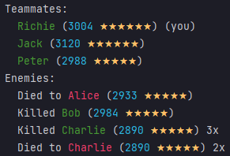
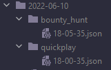
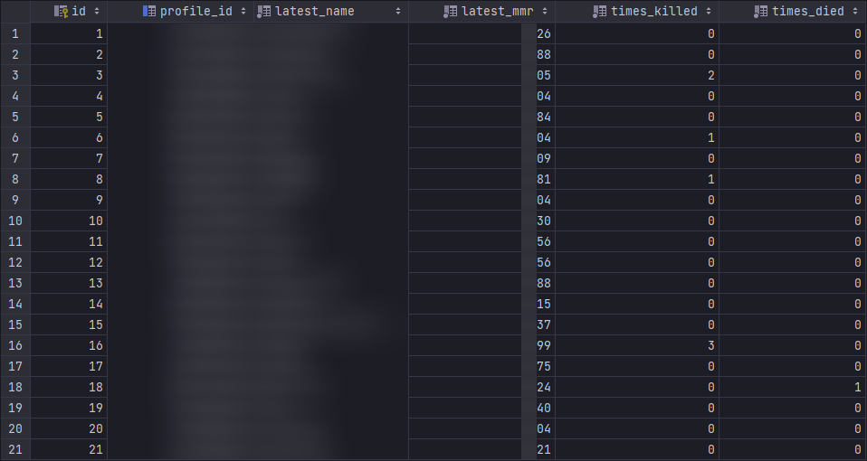

# Hunt MMR
This tool is intended to be used for automatically logging match data provided by the game.

# Installation
- Clone the repository (preferably to a new Python 3.10 virtual environment),
- run `pip install -r requirements.txt` from the root directory.

# Instructions
- Start the Python script (main.py),
- join a match from the game,
- finish the game (extract, die, etc.),
- return to the lobby screen (or any UI element that updates the last match information).

# Screenshots
<!--suppress CheckImageSize, HtmlDeprecatedAttribute -->

    Console log:
     
    

    Match log:
     
    

    Player log:
     
    

# Notice of Non-Affiliation and Disclaimer
We are not affiliated, associated, authorized, endorsed by, or in any way officially connected with Crytek GmbH, or any of its subsidiaries or its affiliates.

The official Crytek GmbH website can be found at https://www.crytek.com/.
The official Hunt: Showdown website can be found at https://www.huntshowdown.com/.

All product and company names are the registered trademarks of their original owners. The use of any trade name or trademark is for identification and reference purposes only and does not imply any association with the trademark holder of their product brand.
